# AI-Driven Data Vault Automation System
## Project Proposal for Complete Data Pipeline Automation

<div align="center">
  <h2>🚀 Autonomous Data Vault 2.0 Pipeline Generation</h2>
  <p><em>Revolutionizing Data Engineering with AI Agents</em></p>
  
  [](.)
  [](.)
  [](.)
  [](.)
</div>

---

## 📋 Executive Summary

This proposal outlines the implementation of an **AI-driven Data Vault automation system** that leverages LangChain agents to autonomously generate complete Data Vault 2.0 pipelines following the proper data flow: **Source → Raw Vault → Business Vault → Access Layer**. 

### 💰 Business Value

| Metric | Current State | With AI System | Improvement |
|--------|---------------|----------------|-------------|
| **Development Time** | 2-3 weeks per model | 2-3 days per model | **🚀 90% reduction** |
| **Code Quality** | Manual review required | Automated validation | **✅ 95%+ pass rate** |
| **Error Rate** | 15-20% manual errors | 2-5% system errors | **📉 80% reduction** |
| **Scalability** | 1-2 models/month | 10+ models/month | **📈 10x increase** |
| **Cost per Model** | $50,000 | $5,000 | **💰 90% cost savings** |

---

## 1. Project Overview

### 1.1 Objectives
- Automate complete Data Vault 2.0 pipeline generation following proper data flow
- Implement multi-agent system for different Data Vault layers
- Integrate with existing vault-etl-framework
- Provide autonomous schema analysis and business key identification
- Generate production-ready code with proper validation

### 1.2 Scope
- **Raw Vault Layer**: Hubs, Links, and Satellites (from source systems)
- **Business Vault Layer**: Business logic and derived entities (from Raw Vault)
- **Access Layer**: Presentation and reporting views (from Business Vault)
- **Framework Integration**: Automated vault-etl-framework updates
- **Quality Assurance**: Automated testing and validation

---

## 2. Technical Architecture

### 2.1 Data Flow Architecture

```
┌─────────────────┐    ┌─────────────────┐    ┌─────────────────┐    ┌─────────────────┐
│   Source Layer  │    │   Raw Vault     │    │  Business Vault │    │  Access Layer   │
│                 │    │                 │    │                 │    │                 │
│ • PostgreSQL    │───▶│ • Hubs          │───▶│ • Business Hubs │───▶│ • Presentation  │
│ • SAP           │    │ • Satellites    │    │ • Business      │    │   Views         │
│ • Salesforce    │    │ • Links         │    │ • etc.          │    │ • Dimensional   │
│ • etc.          │    │ • Link          │    │ • Business      │    │   Models        │
│                 │    │   Satellites    │    │   Links         │    │ • Reporting     │
└─────────────────┘    └─────────────────┘    └─────────────────┘    └─────────────────┘
```

### 🏗️ Technical Architecture

#### 🌊 Data Flow Architecture

```mermaid
graph LR
    A[📂 Source Layer<br/>PostgreSQL, SAP, Salesforce] --> B[🏗️ Raw Vault<br/>Hubs, Satellites, Links]
    B --> C[💼 Business Vault<br/>Business Logic, Rules]
    C --> D[📊 Access Layer<br/>Views, Dimensional Models]
    
    style A fill:#E8F4FD,stroke:#333,stroke-width:2px
    style B fill:#E8F8F5,stroke:#333,stroke-width:2px
    style C fill:#FDF2E9,stroke:#333,stroke-width:2px
    style D fill:#F3E5F5,stroke:#333,stroke-width:2px
```



#### 🤖 Multi-Agent System Design

```mermaid
graph TD
    A["🎯 Orchestrator Agent<br/>Master Coordinator"] --> B["🔍 Source Validation Agent"]
    A --> C["🏗️ Raw Vault Agent"]
    A --> D["💼 Business Vault Agent"]
    A --> E["📊 Access Layer Agent"]
    
    B --> B1["✅ Source Tables Validation"]
    B --> B2["📋 Schema Analysis"]
    B --> B3["🔗 Data Quality Check"]
    
    C --> C1["🏢 Hub Generation"]
    C --> C2["📡 Satellite Generation"]
    C --> C3["🔗 Link Generation"]
    C --> C4["🔗📡 Link Satellite Generation"]
    
    D --> D1["💼 Business Logic"]
    D --> D2["🔄 Derived Entities"]
    D --> D3["📋 Business Rules"]
    
    E --> E1["📊 Presentation Views"]
    E --> E2["⭐ Dimensional Models"]
    E --> E3["📚 Documentation"]
    
    F["📂 Source Tables"] --> B
    B --> G["✅ Validated Sources"]
    G --> C
    C --> H["🏗️ Raw Vault Components"]
    H --> D
    D --> I["💼 Business Vault Components"]
    I --> E
    E --> J["📊 Access Layer Components"]
    
    style A fill:#FFE165,stroke:#333,stroke-width:3px
    style B fill:#E8F4FD,stroke:#333,stroke-width:2px
    style C fill:#E8F8F5,stroke:#333,stroke-width:2px
    style D fill:#FDF2E9,stroke:#333,stroke-width:2px
    style E fill:#F3E5F5,stroke:#333,stroke-width:2px
```



#### **🎯 Orchestrator Agent** (Master Coordinator)
> Central command that coordinates all sub-agents following proper data flow

#### **Stage 1: 🔍 Source Layer Agents**
| Agent | Purpose | Key Outputs |
|-------|---------|-------------|
| **Source Validation Agent** 🔍 | Validate source tables exist in landing zone | ✅ Validation reports |
| **Schema Analysis Agent** 📊 | Analyze source schema and business context | 📋 Business key identification |

#### **Stage 2: 🏗️ Raw Vault Layer Agents**
| Agent | Purpose | Key Outputs |
|-------|---------|-------------|
| **Hub Generation Agent** 🏢 | Create hub scripts with business keys | 🏗️ Hub Python scripts |
| **Satellite Generation Agent** 📡 | Create satellite scripts for source tables | 📡 Satellite Python scripts |
| **Link Generation Agent** 🔗 | Create link scripts for relationships | 🔗 Link Python scripts |
| **Link Satellite Agent** 🔗📡 | Create link satellite scripts | 🔗📡 Link satellite scripts |

#### **Stage 3: 💼 Business Vault Layer Agents**
| Agent | Purpose | Key Outputs |
|-------|---------|-------------|
| **Business Logic Agent** 💼 | Create business logic and transformations | 💼 Business scripts |
| **Derived Entity Agent** 🔄 | Generate derived entities and calculations | 🔄 Derived entity scripts |
| **Business Rules Agent** 📋 | Implement business rules and aggregations | 📋 Business rule scripts |

#### **Stage 4: 📊 Access Layer Agents**
| Agent | Purpose | Key Outputs |
|-------|---------|-------------|
| **Presentation View Agent** 📊 | Create flattened presentation views | 📊 Presentation views |
| **Dimensional Model Agent** ⭐ | Generate star/snowflake schemas | ⭐ Dimensional models |
| **Documentation Agent** 📚 | Generate documentation and metadata | 📚 Technical docs |

#### **Stage 5: 🔧 Framework Integration Agents**
| Agent | Purpose | Key Outputs |
|-------|---------|-------------|
| **Framework Integration Agent** 🔧 | Update vault-etl-framework | 🔧 Framework updates |
| **Migration Script Agent** 📦 | Generate migration scripts | 📦 Migration scripts |

## 🔄 Complete Pipeline Flow: Source → Raw Vault → Business Vault → Access Layer

### 📋 Stage 1: Source Validation & Analysis

#### 🔍 **Input: Source Tables in Landing Zone**
```sql
-- Early Warning Signal Source Tables
TABLE: early_warning_signal
├── early_warning_signal_id (int, PK) 🔑
├── business_partner_id (int, FK)
├── two_month_window_behavioural_score_average (decimal)
├── risk_score (decimal)
├── model_version (varchar)
├── crtd_dt (timestamp)
└── last_updtd_dt (timestamp)

TABLE: early_warning_signal_input  
├── early_warning_signal_input_id (int, PK) 🔑
├── business_partner_id (int, FK)
├── behavioural_model_score_current (decimal)
├── external_model_prediction (decimal)
├── internal_model_prediction (decimal)
├── crtd_dt (timestamp)
└── last_updtd_dt (timestamp)
```

#### 🔍 **Source Validation Agent Process**

```mermaid
graph LR
    A[📂 Source Tables] --> B{🔍 Table Exists?}
    B -->|Yes| C{🔐 Access Check?}
    B -->|No| D[❌ Error: Table Missing]
    C -->|Valid| E{📊 Data Quality?}
    C -->|Invalid| F[❌ Error: No Access]
    E -->|>95%| G[✅ Validation Passed]
    E -->|<95%| H[⚠️ Warning: Low Quality]
    
    style G fill:#90EE90
    style D fill:#FFB6C1
    style F fill:#FFB6C1
    style H fill:#FFE4B5
```


#### ✅ **Source Validation Agent Output**
```yaml
🔍 Source Validation Results:
validation_status: SUCCESS
tables_validated:
  - name: early_warning_signal
    status: ✅ VALID
    location: landing_zone.early_warning_signal
    record_count: 1,250,000
    data_quality: 99.8%
    last_updated: "2024-01-15T10:30:00Z"
    
  - name: early_warning_signal_input  
    status: ✅ VALID
    location: landing_zone.early_warning_signal_input
    record_count: 2,100,000
    data_quality: 99.5%
    last_updated: "2024-01-15T10:25:00Z"

permissions:
  read_access: ✅ GRANTED
  schema_access: ✅ GRANTED
  
connectivity:
  source_system: ✅ ACCESSIBLE
  network_latency: 15ms
```

#### 📊 **Schema Analysis Agent Process**

```mermaid
graph TD
    A[📊 Source Schema] --> B[🔍 Analyze Columns]
    B --> C[🔑 Identify Business Keys]
    B --> D[🔗 Detect Relationships]
    B --> E[📝 Map Data Types]
    
    C --> F[🏢 Recommend Hubs]
    D --> G[🔗 Recommend Links]
    E --> H[📡 Recommend Satellites]
    
    F --> I[📋 Generate Recommendations]
    G --> I
    H --> I
    
    style I fill:#FFE165
```


#### 📊 **Schema Analysis Agent Output**
```yaml
📊 Schema Analysis Results:
business_keys_identified:
  primary_keys:
    - column: early_warning_signal_id
      table: early_warning_signal
      confidence: 100%
      hub_recommendation: EARLY_WARNING_SIGNAL_HUB
      
    - column: early_warning_signal_input_id  
      table: early_warning_signal_input
      confidence: 100%
      hub_recommendation: EARLY_WARNING_SIGNAL_INPUT_HUB
      
  foreign_keys:
    - column: business_partner_id
      tables: [early_warning_signal, early_warning_signal_input]
      relationship_type: one_to_many
      link_recommendation: BUSINESS_PARTNER_LINK

relationships_detected:
  - type: hub_to_hub_via_business_key
    connection: early_warning_signal ↔ early_warning_signal_input
    via_column: business_partner_id
    confidence: 95%
    
data_types_mapped:
  mappings:
    int: IntegerDataType
    decimal: DecimalDataType  
    varchar: StringDataType
    timestamp: DateTimeDataType

recommendations:
  hubs_to_create:
    - name: EARLY_WARNING_SIGNAL_HUB
      business_key: early_warning_signal_id
      source_table: early_warning_signal
      
  satellites_to_create:
    - name: EARLY_WARNING_SIGNAL_SATELLITE
      parent_hub: EARLY_WARNING_SIGNAL_HUB
      source_table: early_warning_signal
      attributes: [risk_score, model_version, behavioral_score]
      
    - name: EARLY_WARNING_SIGNAL_INPUT_SATELLITE
      parent_hub: EARLY_WARNING_SIGNAL_HUB  
      source_table: early_warning_signal_input
      attributes: [external_prediction, internal_prediction]
      
  links_to_create:
    - name: BUSINESS_PARTNER_EARLY_WARNING_LINK
      connected_hubs: [EARLY_WARNING_SIGNAL_HUB, BUSINESS_PARTNER_HUB]
      business_key: business_partner_id
```

#### Stage 2: Raw Vault Generation

**Raw Vault Agent Output:**

**Generated Hub Script:**
```python
# early_warning_signal_hub.py
from model.source import Source
from model.vault.raw_hub import RawHub
from vault_etl_framework.model.business_key import BusinessKey
from vault_etl_framework.model.data_type import StringDataType
from vault_etl_framework.model.field_mapping import FieldMapping
from vault_etl_framework.model.table_mapping import TableMapping
from vault_etl_framework.query.query import Query

EARLY_WARNING_SIGNAL_HUB_FIELD_MAPPING: TableMapping = TableMapping(
    Source.POSTGRES_EARLY_WARNING_SIGNAL,
    [FieldMapping("early_warning_signal_id", "EARLY_WARNING_SIGNAL_ID", StringDataType)]
)

class EarlyWarningSignalHub:
    @staticmethod
    def build_hub():
        return (
            Query(EARLY_WARNING_SIGNAL_HUB_FIELD_MAPPING)
            .build_raw_vault_hub(RawHub.EARLY_WARNING_SIGNAL, BusinessKey(["EARLY_WARNING_SIGNAL_ID"]))
        )

def main():
    EarlyWarningSignalHub.build_hub().write()

if __name__ == "__main__":
    main()
```

**Generated Satellite Script:**
```python
# early_warning_signal_satellite.py
from model.vault.raw_hub_satellite import RawHubSatellite
from early_warning_signal_satellite_fields import EARLY_WARNING_SIGNAL_SATELLITE_FIELDS_MAPPING, EARLY_WARNING_SIGNAL_HUB_FIELDS_MAPPING
from vault_etl_framework.model.business_key import BusinessKey
from vault_etl_framework.query.query import Query
from vault_etl_framework.model.join_condition import JoinCondition

def main():
    Query(EARLY_WARNING_SIGNAL_SATELLITE_FIELDS_MAPPING)
        .join(Query(EARLY_WARNING_SIGNAL_HUB_FIELDS_MAPPING), JoinCondition('EARLY_WARNING_SIGNAL_ID'))
        .drop(['EARLY_WARNING_SIGNAL_ID'])
        .build_raw_vault_hub_satellite(RawHubSatellite.EARLY_WARNING_SIGNAL_SATELLITE, BusinessKey('EARLY_WARNING_SIGNAL_ID'))
        .write()

if __name__ == "__main__":
    main()
```

**Generated Link Script:**
```python
# early_warning_signal_input_link.py
from model.vault.raw_link import RawLink
from early_warning_signal_input_link_fields import EARLY_WARNING_SIGNAL_INPUT_LINK_FIELDS_MAPPING
from vault_etl_framework.model.business_key import BusinessKey
from vault_etl_framework.query.query import Query

def main():
    Query(EARLY_WARNING_SIGNAL_INPUT_LINK_FIELDS_MAPPING)
        .build_raw_vault_link(RawLink.EARLY_WARNING_SIGNAL_INPUT_LINK, BusinessKey(['EARLY_WARNING_SIGNAL_ID', 'EARLY_WARNING_SIGNAL_INPUT_ID']))
        .write()

if __name__ == "__main__":
    main()
```

#### Stage 3: Business Vault Generation

**Business Vault Agent Input (from Raw Vault):**
```
Raw Vault Components:
├── Hubs: EARLY_WARNING_SIGNAL_HUB
├── Satellites: EARLY_WARNING_SIGNAL_SATELLITE, EARLY_WARNING_SIGNAL_INPUT_SATELLITE
└── Links: EARLY_WARNING_SIGNAL_INPUT_LINK
```

**Business Vault Agent Output:**

**Generated Business Hub Script:**
```python
# early_warning_signal_business_hub.py
from model.vault.business_hub import BusinessHub
from vault_etl_framework.model.business_key import BusinessKey
from vault_etl_framework.query.query import Query

class EarlyWarningSignalBusinessHub:
    @staticmethod
    def build_business_hub():
        return (
            Query(RAW_VAULT_EARLY_WARNING_SIGNAL_MAPPING)
            .join(Query(RAW_VAULT_EARLY_WARNING_SIGNAL_INPUT_MAPPING), JoinCondition('BUSINESS_PARTNER_ID'))
            .apply_business_logic([
                "filter_active_signals",
                "calculate_risk_score",
                "apply_business_rules"
            ])
            .build_business_vault_hub(BusinessHub.EARLY_WARNING_SIGNAL_BUSINESS, BusinessKey(["EARLY_WARNING_SIGNAL_ID"]))
        )

def main():
    EarlyWarningSignalBusinessHub.build_business_hub().write()

if __name__ == "__main__":
    main()
```

**Generated Business Satellite Script:**
```python
# early_warning_signal_business_satellite.py
from model.vault.business_hub_satellite import BusinessHubSatellite
from vault_etl_framework.model.business_key import BusinessKey
from vault_etl_framework.query.query import Query

def main():
    Query(BUSINESS_SATELLITE_FIELD_MAPPING)
        .join(Query(BUSINESS_HUB_FIELD_MAPPING), JoinCondition('EARLY_WARNING_SIGNAL_ID'))
        .apply_business_transformations([
            "calculate_behavioral_score_trend",
            "apply_risk_thresholds",
            "generate_alert_flags"
        ])
        .build_business_vault_hub_satellite(BusinessHubSatellite.EARLY_WARNING_SIGNAL_BUSINESS_SATELLITE, BusinessKey('EARLY_WARNING_SIGNAL_ID'))
        .write()

if __name__ == "__main__":
    main()
```

#### Stage 4: Access Layer Generation

**Access Layer Agent Input (from Business Vault):**
```
Business Vault Components:
├── Business Hubs: EARLY_WARNING_SIGNAL_BUSINESS_HUB
├── Business Satellites: EARLY_WARNING_SIGNAL_BUSINESS_SATELLITE
└── Business Links: EARLY_WARNING_SIGNAL_BUSINESS_LINK
```

**Access Layer Agent Output:**

**Generated Presentation View Script:**
```python
# early_warning_signal_presentation_view.py
from model.vault.access_view import AccessView
from vault_etl_framework.query.query import Query

class EarlyWarningSignalPresentationView:
    @staticmethod
    def build_presentation_view():
        return (
            Query(BUSINESS_VAULT_EARLY_WARNING_SIGNAL_MAPPING)
            .flatten([
                "customer_dimension",
                "time_dimension", 
                "risk_dimension"
            ])
            .apply_presentation_logic([
                "format_currency_fields",
                "apply_date_formatting",
                "generate_summary_metrics"
            ])
            .build_access_layer_view(AccessView.EARLY_WARNING_SIGNAL_PRESENTATION)
        )

def main():
    EarlyWarningSignalPresentationView.build_presentation_view().write()

if __name__ == "__main__":
    main()
```

**Generated Dimensional Model Script:**
```python
# early_warning_signal_dimensional_model.py
from model.vault.dimensional_model import DimensionalModel
from vault_etl_framework.query.query import Query

class EarlyWarningSignalDimensionalModel:
    @staticmethod
    def build_dimensional_model():
        return (
            Query(EARLY_WARNING_SIGNAL_FACT_TABLE_MAPPING)
            .join_dimensions([
                "customer_dim",
                "time_dim", 
                "product_dim",
                "risk_dim"
            ])
            .apply_dimensional_logic([
                "calculate_fact_metrics",
                "apply_aggregations",
                "generate_hierarchies"
            ])
            .build_dimensional_model(DimensionalModel.EARLY_WARNING_SIGNAL_STAR_SCHEMA)
        )

def main():
    EarlyWarningSignalDimensionalModel.build_dimensional_model().write()

if __name__ == "__main__":
    main()
```

#### Stage 5: Framework Integration

**Framework Integration Agent Output:**

**Updated Source Definitions:**
```python
# Updated source.py
POSTGRES_EARLY_WARNING_SIGNAL = SourceTableDefinition(
    SourceDatabase.POSTGRES,
    'SMALL_BUSINESS_ACCOUNT_MONITORING',
    'EARLY_WARNING_SIGNAL',
    'EARLY_WARNING_SIGNAL_ID'
)

POSTGRES_EARLY_WARNING_SIGNAL_INPUT = SourceTableDefinition(
    SourceDatabase.POSTGRES,
    'SMALL_BUSINESS_ACCOUNT_MONITORING',
    'EARLY_WARNING_SIGNAL_INPUT',
    'EARLY_WARNING_SIGNAL_INPUT_ID'
)
```

**Updated Raw Hub Definitions:**
```python
# Updated raw_hub.py
EARLY_WARNING_SIGNAL = "early_warning_signal"
EARLY_WARNING_SIGNAL_INPUT = "early_warning_signal_input"
```

**Generated Migration Script:**
```python
# migration_v1_2.py
def migrate_v1_2():
    """Migration script for version 1.2 - Early Warning Signal Model."""
    
    # Add new source definitions
    add_source_definition("POSTGRES_EARLY_WARNING_SIGNAL")
    add_source_definition("POSTGRES_EARLY_WARNING_SIGNAL_INPUT")
    
    # Add new hub definitions
    add_hub_definition("EARLY_WARNING_SIGNAL")
    add_hub_definition("EARLY_WARNING_SIGNAL_INPUT")
    
    # Add new satellite definitions
    add_satellite_definition("EARLY_WARNING_SIGNAL_SATELLITE")
    add_satellite_definition("EARLY_WARNING_SIGNAL_INPUT_SATELLITE")
    
    # Add new link definitions
    add_link_definition("EARLY_WARNING_SIGNAL_INPUT_LINK")
    
    print("✅ Migration v1.2 completed successfully")
```

### 2.3 Agent System Stages (Based on Databricks Guide)

#### 2.3.1 Stage 1: Prepare Data
- **Source Validation Agent**: Verify source tables exist in landing zone
- **Schema Analysis Agent**: Analyze source schema and business context
- **Data Quality Agent**: Assess data quality and readiness

#### 2.3.2 Stage 2: Build Agents
- **Raw Vault Agent**: Generate Raw Vault components (Hubs, Satellites, Links)
- **Business Vault Agent**: Generate Business Vault components
- **Access Layer Agent**: Generate Access Layer components
- **Framework Integration Agent**: Update vault-etl-framework

#### 2.3.3 Stage 3: Deploy Agents
- **Orchestrator Agent**: Coordinate pipeline execution
- **Validation Agent**: Ensure generated code quality
- **Testing Agent**: Run automated tests

#### 2.3.4 Stage 4: Evaluate Performance
- **Quality Assessment Agent**: Evaluate generated code quality
- **Performance Monitoring Agent**: Monitor generation performance
- **Feedback Agent**: Collect and process feedback

#### 2.3.5 Stage 5: Govern Operations
- **Security Agent**: Ensure security and compliance
- **Audit Agent**: Track changes and maintain audit trail
- **Version Control Agent**: Manage code versions and migrations

### 2.4 Agent Responsibilities

#### 2.4.1 Orchestrator Agent
- **Purpose**: Master coordinator for entire pipeline generation
- **Responsibilities**:
  - Coordinate all sub-agents following proper data flow
  - Manage workflow and dependencies between layers
  - Handle error recovery and fallbacks
  - Generate final output and reports
  - Ensure proper sequence: Source → Raw Vault → Business Vault → Access Layer

#### 2.4.2 Source Validation Agent
- **Purpose**: Validate source tables exist in landing zone
- **Responsibilities**:
  - Check source table availability
  - Verify table structure and permissions
  - Validate data accessibility
  - Confirm source system connectivity

#### 2.4.3 Schema Analysis Agent
- **Purpose**: Analyze source tables and business context
- **Responsibilities**:
  - Identify business keys and relationships
  - Analyze data patterns and field classifications
  - Recommend hub and satellite structures
  - Validate schema consistency
  - Map source to target structures

#### 2.4.4 Raw Vault Agent
- **Purpose**: Generate Raw Vault components from source
- **Responsibilities**:
  - Create hub scripts with proper business keys
  - Generate satellite scripts for source tables
  - Create link scripts for relationships
  - Generate link satellite scripts
  - Update vault-etl-framework definitions
  - Validate Raw Vault structure

#### 2.4.5 Business Vault Agent
- **Purpose**: Generate Business Vault components from Raw Vault
- **Responsibilities**:
  - Create business logic and transformations
  - Generate derived entities and calculations
  - Create business hubs and satellites
  - Generate business links and link satellites
  - Implement business rules and aggregations
  - Handle complex business scenarios

#### 2.4.6 Access Layer Agent
- **Purpose**: Generate Access Layer components from Business Vault
- **Responsibilities**:
  - Create flattened presentation views
  - Generate dimensional models (star/snowflake)
  - Create reporting views and aggregations
  - Implement access layer transformations
  - Generate documentation and metadata

#### 2.4.7 Framework Integration Agent
- **Purpose**: Update vault-etl-framework components
- **Responsibilities**:
  - Update source definitions
  - Add new hub and satellite definitions
  - Maintain framework consistency
  - Version control and change management
  - Generate migration scripts

---

## 3. Implementation Plan

### 3.1 Phase 1: Foundation (Weeks 1-2) ✅
- [x] **Core Agent Framework**: Implement base agent architecture
- [x] **Schema Analysis Agent**: Complete implementation
- [x] **Hub Generation Agent**: Complete implementation
- [x] **Satellite Generation Agent**: Complete implementation
- [x] **Orchestrator Agent**: Complete implementation
- [x] **Basic CLI Interface**: Command-line tools for generation

### 3.2 Phase 2: Source Validation & Raw Vault Enhancement (Weeks 3-4)
- [ ] **Source Validation Agent**: Implement source table validation
- [ ] **Link Generation Agent**: Generate link and link satellite scripts
- [ ] **Enhanced Raw Vault Agent**: Complete Raw Vault pipeline
- [ ] **Data Quality Agent**: Implement data quality checks
- [ ] **Raw Vault Validation**: Ensure proper Raw Vault structure

### 3.3 Phase 3: Business Vault Layer (Weeks 5-6)
- [ ] **Business Vault Agent**: Implement business logic generation
- [ ] **Business Rules Engine**: Create rule-based transformations
- [ ] **Derived Entity Generation**: Handle complex business calculations
- [ ] **Business Logic Validation**: Ensure accuracy and consistency
- [ ] **Business Vault Integration**: Connect with Raw Vault

### 3.4 Phase 4: Access Layer (Weeks 7-8)
- [ ] **Access Layer Agent**: Implement presentation layer generation
- [ ] **Dimensional Model Generation**: Create star/snowflake schemas
- [ ] **Reporting View Creation**: Generate flattened views
- [ ] **Documentation Generation**: Auto-generate technical documentation
- [ ] **Access Layer Integration**: Connect with Business Vault

### 3.5 Phase 5: Framework Integration & Quality Assurance (Weeks 9-10)
- [ ] **Framework Integration Agent**: Implement vault-etl-framework updates
- [ ] **Source Definition Management**: Automated source registration
- [ ] **Version Control Integration**: Track changes and versions
- [ ] **Migration Scripts**: Generate framework update scripts
- [ ] **Automated Testing**: Implement comprehensive test suites
- [ ] **Code Quality Validation**: Ensure best practices

### 3.6 Phase 6: Production Deployment (Weeks 11-12)
- [ ] **Production Environment Setup**: Deploy to production
- [ ] **Monitoring and Logging**: Implement comprehensive monitoring
- [ ] **User Training**: Train development teams
- [ ] **Documentation**: Complete user and technical documentation

---

## 4. Technical Specifications

### 4.1 Technology Stack

#### 4.1.1 Core Technologies
- **Python 3.9+**: Primary development language
- **LangChain**: Agent framework and LLM orchestration
- **LangChain-Community**: Community integrations
- **Pydantic**: Data validation and serialization
- **Pathlib**: File system operations

#### 4.1.2 LLM Integration
- **Groq API**: Primary cloud LLM (llama3-70b-8192)
- **Ollama**: Local LLM support for development
- **LangChain LLM Wrappers**: Unified LLM interface

#### 4.1.3 Data Vault Framework
- **vault-etl-framework**: Existing framework integration
- **Custom Components**: BusinessKey, FieldMapping, TableMapping
- **Query Builder**: Dynamic query generation

### 4.2 Agent Architecture Details

#### 4.2.1 Agent Communication
```python
class AgentMessage:
    sender: str
    recipient: str
    message_type: str
    content: Dict[str, Any]
    metadata: Dict[str, Any]
    stage: str  # Source, RawVault, BusinessVault, AccessLayer
```

#### 4.2.2 Tool Integration
```python
class BaseVaultTool(BaseTool):
    name: str
    description: str
    agent_type: str
    stage: str  # Which Data Vault stage this tool belongs to
    
    def _run(self, input_data: str) -> str:
        # Tool implementation
        pass
```

#### 4.2.3 Memory Management
```python
class AgentMemory:
    conversation_history: List[AgentMessage]
    context_data: Dict[str, Any]
    learning_examples: List[Dict[str, Any]]
    stage_progress: Dict[str, bool]  # Track progress through stages
```

### 4.3 Code Generation Patterns

#### 4.3.1 Raw Vault Hub Generation Pattern
```python
class {HubName}Hub:
    @staticmethod
    def build_hub():
        return (
            Query({HUB_FIELD_MAPPING})
            .build_raw_vault_hub(RawHub.{HUB_NAME}, BusinessKey([{BUSINESS_KEYS}]))
        )
```

#### 4.3.2 Raw Vault Satellite Generation Pattern
```python
def main():
    Query({SATELLITE_FIELD_MAPPING})
        .join(Query({HUB_FIELD_MAPPING}), JoinCondition('{JOIN_KEY}'))
        .drop(['{JOIN_KEY}'])
        .build_raw_vault_hub_satellite(RawHubSatellite.{SATELLITE_NAME}, BusinessKey('{BUSINESS_KEY}'))
        .write()
```

#### 4.3.3 Business Vault Generation Pattern
```python
class {BusinessEntity}BusinessRule:
    @staticmethod
    def apply_business_logic(raw_vault_data: Query) -> Query:
        return (
            raw_vault_data
            .join(Query({BUSINESS_JOIN_MAPPING}), JoinCondition('{JOIN_KEY}'))
            .filter({BUSINESS_CONDITIONS})
            .transform({BUSINESS_TRANSFORMATIONS})
            .build_business_vault_entity(BusinessEntity.{ENTITY_NAME})
        )
```

#### 4.3.4 Access Layer Generation Pattern
```python
class {Entity}PresentationView:
    @staticmethod
    def build_presentation_view():
        return (
            Query({BUSINESS_VAULT_MAPPING})
            .flatten({FLATTENING_RULES})
            .apply_presentation_logic({PRESENTATION_RULES})
            .build_access_layer_view(AccessView.{VIEW_NAME})
        )
```

---

## 5. Quality Assurance

### 5.1 Automated Testing
- **Unit Tests**: Individual agent functionality
- **Integration Tests**: Agent communication and coordination
- **End-to-End Tests**: Complete pipeline generation
- **Performance Tests**: Generation speed and resource usage
- **Stage Validation**: Ensure proper data flow between stages

### 5.2 Code Quality
- **Static Analysis**: Type checking and linting
- **Code Review**: Automated and manual review processes
- **Documentation**: Auto-generated technical documentation
- **Best Practices**: Enforced coding standards

### 5.3 Validation Framework
```python
class VaultValidator:
    def validate_source_tables(self, source_tables: List[str]) -> ValidationResult:
        # Source validation logic
        pass
    
    def validate_raw_vault(self, raw_vault_code: str) -> ValidationResult:
        # Raw Vault validation logic
        pass
    
    def validate_business_vault(self, business_vault_code: str) -> ValidationResult:
        # Business Vault validation logic
        pass
    
    def validate_access_layer(self, access_layer_code: str) -> ValidationResult:
        # Access Layer validation logic
        pass
    
    def validate_pipeline_flow(self, pipeline_components: Dict[str, str]) -> ValidationResult:
        # Ensure proper data flow: Source → Raw Vault → Business Vault → Access Layer
        pass
```

---

## 6. Deployment Strategy

### 6.1 Development Environment
- **Local Development**: Ollama for local LLM testing
- **Development Server**: Dedicated development environment
- **Version Control**: Git with feature branching
- **CI/CD**: Automated testing and deployment

### 6.2 Production Environment
- **Cloud Deployment**: AWS/Azure cloud infrastructure
- **LLM Integration**: Groq API for production workloads
- **Monitoring**: Comprehensive logging and monitoring
- **Security**: API key management and access controls

### 6.3 Scaling Strategy
- **Horizontal Scaling**: Multiple agent instances
- **Load Balancing**: Distribute generation requests
- **Caching**: Cache common patterns and examples
- **Queue Management**: Handle high-volume requests

---

## 7. Risk Assessment

### 7.1 Technical Risks
- **LLM Reliability**: Dependency on external LLM services
- **Code Quality**: Ensuring generated code meets standards
- **Performance**: Handling large and complex schemas
- **Integration**: Compatibility with existing frameworks
- **Data Flow**: Ensuring proper sequence between stages

### 7.2 Mitigation Strategies
- **Fallback Mechanisms**: Local LLM and rule-based generation
- **Quality Gates**: Automated validation and testing
- **Performance Monitoring**: Continuous performance tracking
- **Incremental Integration**: Gradual framework integration
- **Stage Validation**: Ensure proper data flow validation

---

## 8. Success Metrics

### 8.1 Development Efficiency
- **Time Reduction**: 90% reduction in development time
- **Code Quality**: 95%+ generated code passes validation
- **Error Reduction**: 80% reduction in manual errors
- **Consistency**: 100% adherence to Data Vault patterns
- **Pipeline Flow**: 100% correct data flow between stages

### 8.2 Business Impact
- **Faster Time to Market**: Reduced development cycles
- **Cost Savings**: Reduced development and maintenance costs
- **Scalability**: Handle 10x more models simultaneously
- **Knowledge Retention**: Preserve expertise in AI models

---

## 9. Resource Requirements

### 9.1 Team Composition
- **1 Senior Data Engineer**: Technical lead and architecture
- **1 ML Engineer**: LLM integration and agent optimization
- **1 Data Vault Expert**: Domain expertise and validation
- **1 DevOps Engineer**: Infrastructure and deployment

### 9.2 Infrastructure
- **Development Environment**: Local development setup
- **Testing Environment**: Dedicated testing infrastructure
- **Production Environment**: Cloud-based production deployment
- **Monitoring Tools**: Comprehensive monitoring and alerting

### 9.3 External Dependencies
- **Groq API**: Cloud LLM service
- **Ollama**: Local LLM for development
- **vault-etl-framework**: Existing framework integration

---

## 10. Timeline and Milestones

### 10.1 Project Timeline
```
Week 1-2:   Foundation & Core Agents
Week 3-4:   Source Validation & Raw Vault Enhancement
Week 5-6:   Business Vault Layer
Week 7-8:   Access Layer
Week 9-10:  Framework Integration & Quality Assurance
Week 11-12: Production Deployment
```

### 10.2 Key Milestones
- **M1 (Week 2)**: Core agent framework complete
- **M2 (Week 4)**: Complete Raw Vault pipeline (including Links)
- **M3 (Week 6)**: Business vault generation complete
- **M4 (Week 8)**: Access layer generation complete
- **M5 (Week 10)**: Framework integration and QA complete
- **M6 (Week 12)**: Production deployment complete

---

## 11. Budget Estimation

### 11.1 Development Costs
- **Team Resources**: $120,000 (12 weeks × $10,000/week)
- **Infrastructure**: $5,000 (cloud services and tools)
- **External Services**: $3,000 (LLM API costs)
- **Total Development**: $128,000

### 11.2 Operational Costs
- **Monthly Infrastructure**: $2,000
- **LLM API Usage**: $1,000/month
- **Maintenance**: $5,000/month
- **Total Annual Operations**: $96,000

### 11.3 ROI Projection
- **Development Time Savings**: $500,000/year
- **Error Reduction**: $100,000/year
- **Scalability Benefits**: $200,000/year
- **Total Annual Savings**: $800,000
- **ROI**: 625% in first year

---

## 12. Conclusion

The AI-driven Data Vault automation system represents a significant advancement in data engineering efficiency and quality. By leveraging LangChain agents and modern LLM technology, we can automate the entire Data Vault pipeline generation process while maintaining high code quality and consistency.

The proposed system follows the proper Data Vault methodology:
1. **Source Layer**: Validate and analyze source tables
2. **Raw Vault Layer**: Generate Hubs, Satellites, Links, and Link Satellites from source
3. **Business Vault Layer**: Generate business logic and derived entities from Raw Vault
4. **Access Layer**: Generate presentation and reporting views from Business Vault

The system will:
- Reduce development time by 90%
- Improve code quality and consistency
- Enable rapid scaling of Data Vault implementations
- Preserve and enhance organizational knowledge
- Provide significant cost savings and ROI
- Ensure proper data flow between all layers

This investment in automation will position the organization as a leader in modern data engineering practices and provide a competitive advantage in data-driven decision making.

---

## Appendix

### A. Current Implementation Status
- ✅ Core agent framework implemented
- ✅ Schema analysis agent complete
- ✅ Hub generation agent complete
- ✅ Satellite generation agent complete
- ✅ Orchestrator agent complete
- ✅ Basic CLI interface functional

### B. Sample Generated Code
See `generated/` directory for examples of generated Data Vault components.

### C. Technical Documentation
Comprehensive technical documentation available in the project repository.

### D. Contact Information
For questions or clarifications, please contact the project team. 